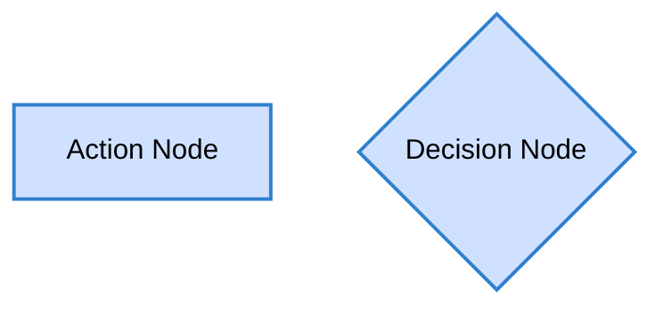

# Graph Visualization

## Executable Graph

```mermaid
graph TD
    node0[df]
    node1[basic_cleaning]
    node2[panel_cleaned_data]
    node3{single_treated_unit}
    node4{multi_post_periods}
    node5{stag_treat}
    node6[did_spec]
    node7[did_spec_balance]
    node8[did_spec_balance_table]
    node9[did_spec_balance_plot]
    node10[ols_did]
    node11[save_ols_did]
    node12[event_spec]
    node13[event_spec_balance]
    node14[event_spec_balance_table]
    node15[event_spec_balance_plot]
    node16[ols_event]
    node17[event_plot]
    node18[save_event_output]
    node19[synthdid_spec]
    node20[synthdid_spec_balance]
    node21[synthdid_spec_balance_table]
    node22[synthdid_spec_balance_plot]
    node23[synthdid_fit]
    node24[synthdid_plot]
    node25[hainmueller_fit]
    node26[hainmueller_placebo_test]
    node27[hainmueller_effect_plot]
    node28[hainmueller_validity_plot]
    node29[hainmueller_output]
    node30[stag_spec]
    node31[stag_spec_balance]
    node32[stag_spec_balance_table]
    node33[stag_spec_balance_plot]
    node34[ols_stag]
    node35{has_never_treated}
    node36[cs_never_treated]
    node37[cs_never_treated_plot]
    node38[cs_never_treated_group_plot]
    node39[cs_not_yet_treated]
    node40[cs_not_yet_treated_plot]
    node41[cs_not_yet_treated_group_plot]
    node42[stag_event_plot]
    node43[save_stag_output]
    node0 --> node1
    node1 --> node2
    node2 --> node3
    node3 -->|False| node4
    node3 -->|True| node19
    node4 -->|True| node5
    node4 -->|False| node6
    node5 -->|False| node12
    node5 -->|True| node30
    node6 --> node7
    node7 --> node8
    node7 --> node9
    node7 --> node10
    node10 --> node11
    node12 --> node13
    node13 --> node14
    node13 --> node15
    node13 --> node16
    node16 --> node17
    node16 --> node18
    node19 --> node20
    node19 --> node25
    node20 --> node21
    node20 --> node22
    node20 --> node23
    node23 --> node24
    node25 --> node26
    node25 --> node27
    node26 --> node28
    node26 --> node29
    node30 --> node31
    node31 --> node32
    node31 --> node33
    node31 --> node34
    node31 --> node35
    node34 --> node42
    node34 --> node43
    node35 -->|True| node36
    node35 -->|False| node39
    node36 --> node37
    node36 --> node38
    node39 --> node40
    node39 --> node41

    %% Node styling
    classDef pendingNode fill:lightblue,stroke:#3080cf,stroke-width:2px,color:black;
    classDef runningNode fill:yellow,stroke:#3080cf,stroke-width:2px,color:black;
    classDef completedNode fill:lightgreen,stroke:#3080cf,stroke-width:2px,color:black;
    classDef failedNode fill:salmon,stroke:#3080cf,stroke-width:2px,color:black;
    classDef passedNode fill:#d8d8d8,stroke:#3080cf,stroke-width:2px,color:black;
    style node0 fill:lightgreen,stroke:#3080cf,stroke-width:2px,color:black
    style node1 fill:lightgreen,stroke:#3080cf,stroke-width:2px,color:black
    style node2 fill:lightgreen,stroke:#3080cf,stroke-width:2px,color:black
    style node3 fill:lightgreen,stroke:#3080cf,stroke-width:2px,color:black
    style node4 fill:#d8d8d8,stroke:#3080cf,stroke-width:2px,color:black
    style node5 fill:#d8d8d8,stroke:#3080cf,stroke-width:2px,color:black
    style node6 fill:#d8d8d8,stroke:#3080cf,stroke-width:2px,color:black
    style node7 fill:#d8d8d8,stroke:#3080cf,stroke-width:2px,color:black
    style node8 fill:#d8d8d8,stroke:#3080cf,stroke-width:2px,color:black
    style node9 fill:#d8d8d8,stroke:#3080cf,stroke-width:2px,color:black
    style node10 fill:#d8d8d8,stroke:#3080cf,stroke-width:2px,color:black
    style node11 fill:#d8d8d8,stroke:#3080cf,stroke-width:2px,color:black
    style node12 fill:#d8d8d8,stroke:#3080cf,stroke-width:2px,color:black
    style node13 fill:#d8d8d8,stroke:#3080cf,stroke-width:2px,color:black
    style node14 fill:#d8d8d8,stroke:#3080cf,stroke-width:2px,color:black
    style node15 fill:#d8d8d8,stroke:#3080cf,stroke-width:2px,color:black
    style node16 fill:#d8d8d8,stroke:#3080cf,stroke-width:2px,color:black
    style node17 fill:#d8d8d8,stroke:#3080cf,stroke-width:2px,color:black
    style node18 fill:#d8d8d8,stroke:#3080cf,stroke-width:2px,color:black
    style node19 fill:lightgreen,stroke:#3080cf,stroke-width:2px,color:black
    style node20 fill:lightgreen,stroke:#3080cf,stroke-width:2px,color:black
    style node21 fill:lightgreen,stroke:#3080cf,stroke-width:2px,color:black
    style node22 fill:lightgreen,stroke:#3080cf,stroke-width:2px,color:black
    style node23 fill:lightgreen,stroke:#3080cf,stroke-width:2px,color:black
    style node24 fill:lightgreen,stroke:#3080cf,stroke-width:2px,color:black
    style node25 fill:lightgreen,stroke:#3080cf,stroke-width:2px,color:black
    style node26 fill:lightgreen,stroke:#3080cf,stroke-width:2px,color:black
    style node27 fill:lightgreen,stroke:#3080cf,stroke-width:2px,color:black
    style node28 fill:lightgreen,stroke:#3080cf,stroke-width:2px,color:black
    style node29 fill:lightgreen,stroke:#3080cf,stroke-width:2px,color:black
    style node30 fill:#d8d8d8,stroke:#3080cf,stroke-width:2px,color:black
    style node31 fill:#d8d8d8,stroke:#3080cf,stroke-width:2px,color:black
    style node32 fill:#d8d8d8,stroke:#3080cf,stroke-width:2px,color:black
    style node33 fill:#d8d8d8,stroke:#3080cf,stroke-width:2px,color:black
    style node34 fill:#d8d8d8,stroke:#3080cf,stroke-width:2px,color:black
    style node35 fill:#d8d8d8,stroke:#3080cf,stroke-width:2px,color:black
    style node36 fill:#d8d8d8,stroke:#3080cf,stroke-width:2px,color:black
    style node37 fill:#d8d8d8,stroke:#3080cf,stroke-width:2px,color:black
    style node38 fill:#d8d8d8,stroke:#3080cf,stroke-width:2px,color:black
    style node39 fill:#d8d8d8,stroke:#3080cf,stroke-width:2px,color:black
    style node40 fill:#d8d8d8,stroke:#3080cf,stroke-width:2px,color:black
    style node41 fill:#d8d8d8,stroke:#3080cf,stroke-width:2px,color:black
    style node42 fill:#d8d8d8,stroke:#3080cf,stroke-width:2px,color:black
    style node43 fill:#d8d8d8,stroke:#3080cf,stroke-width:2px,color:black
```

## Node Legend

### Node Types

```mermaid
graph LR
    actionNode[Action Node] ~~~ decisionNode{Decision Node}
    style actionNode fill:#d0e0ff,stroke:#3080cf,stroke-width:2px,color:black
    style decisionNode fill:#d0e0ff,stroke:#3080cf,stroke-width:2px,color:black
```

### Node States

```mermaid
graph LR
    pendingNode[Pending]:::pendingNode ~~~ runningNode[Running]:::runningNode ~~~ completedNode[Completed]:::completedNode ~~~ failedNode[Failed]:::failedNode ~~~ passedNode[Passed]:::passedNode

    classDef pendingNode fill:lightblue,stroke:#3080cf,stroke-width:2px,color:black;
    classDef runningNode fill:yellow,stroke:#3080cf,stroke-width:2px,color:black;
    classDef completedNode fill:lightgreen,stroke:#3080cf,stroke-width:2px,color:black;
    classDef failedNode fill:salmon,stroke:#3080cf,stroke-width:2px,color:black;
    classDef passedNode fill:#d8d8d8,stroke:#3080cf,stroke-width:2px,color:black;
```

Node state coloring indicates the execution status of each node in the graph.
